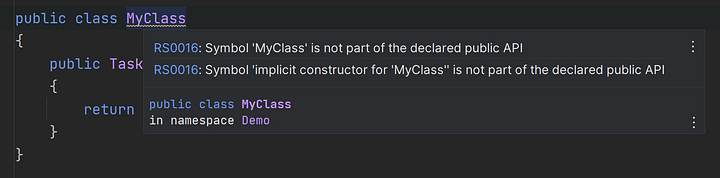

# Public API Management with Microsoft.CodeAnalysis.PublicApiAnalyzers

We use `Microsoft.CodeAnalysis.PublicApiAnalyzers` in this repository. By using this analyzer, we can keep track of changes to the public API.

## Integration Packages

We have several packages called integration. For each of these packages, we add a public API. Each package should have the following files:
- `PublicAPI.Shipped.txt`
- `PublicAPI.Unshipped.txt`

## Creating/Updating Public API Files

### Steps for Contributors


1. **Create these two files**:

- `PublicAPI.Shipped.txt`
- `PublicAPI.Unshipped.txt`

If you're using nullable reference types, then add the following line at the top of each `PublicAPI.*.txt` file:
```
#nullable enable
```

2. **Add New Public API**:

   - In `PublicAPI.Shipped.txt`, list all the public APIs you've given out.
   - In `PublicAPI.Unshipped.txt`, list any preview or soon-to-change APIs. For example, if an API will soon be removed (marked with `[Obsolete]`), add it here so you remember to take it out later.
   
    - Consider the following representative C# public class:
    ```csharp
    namespace Demo;

    public class MyClass
    {
        public Task DoSomethingAsync(Uri uri, CancellationToken cancellationToken)
        {
            return Task.CompletedTask;
        }
    }

    ```

    Warnings issued by the Microsoft.CodeAnalysis.PublicApiAnalyzers package:

    
    
    You can use `. + Ctrl` to open the code actions and see the available options. In this case, the warning is suggesting that we should add the `MyClass` type to the `PublicAPI.*.txt` files.
3. **Update Existing Public API**:
   - If you modify existing public API members, update the `PublicAPI.Unshipped.txt` file accordingly.
   - Ensure that the changes reflect the new API surface.

4. **Shipping Public API**:
   - Once a version is released,We move the entries from `PublicAPI.Unshipped.txt` to `PublicAPI.Shipped.txt`.
   - This indicates that the API changes are now part of a shipped version.

By following these steps, we can maintain a consistent and accurate record of our public API changes.

Additional resources:
- [Microsoft.CodeAnalysis.PublicApiAnalyzers documentation.](https://github.com/dotnet/roslyn-analyzers/blob/main/src/PublicApiAnalyzers/PublicApiAnalyzers.Help.md)
- [Microsoft.CodeAnalysis.PublicApiAnalyzers list of analysis rules.](https://github.com/dotnet/roslyn-analyzers/blob/main/src/PublicApiAnalyzers/Microsoft.CodeAnalysis.PublicApiAnalyzers.md)
